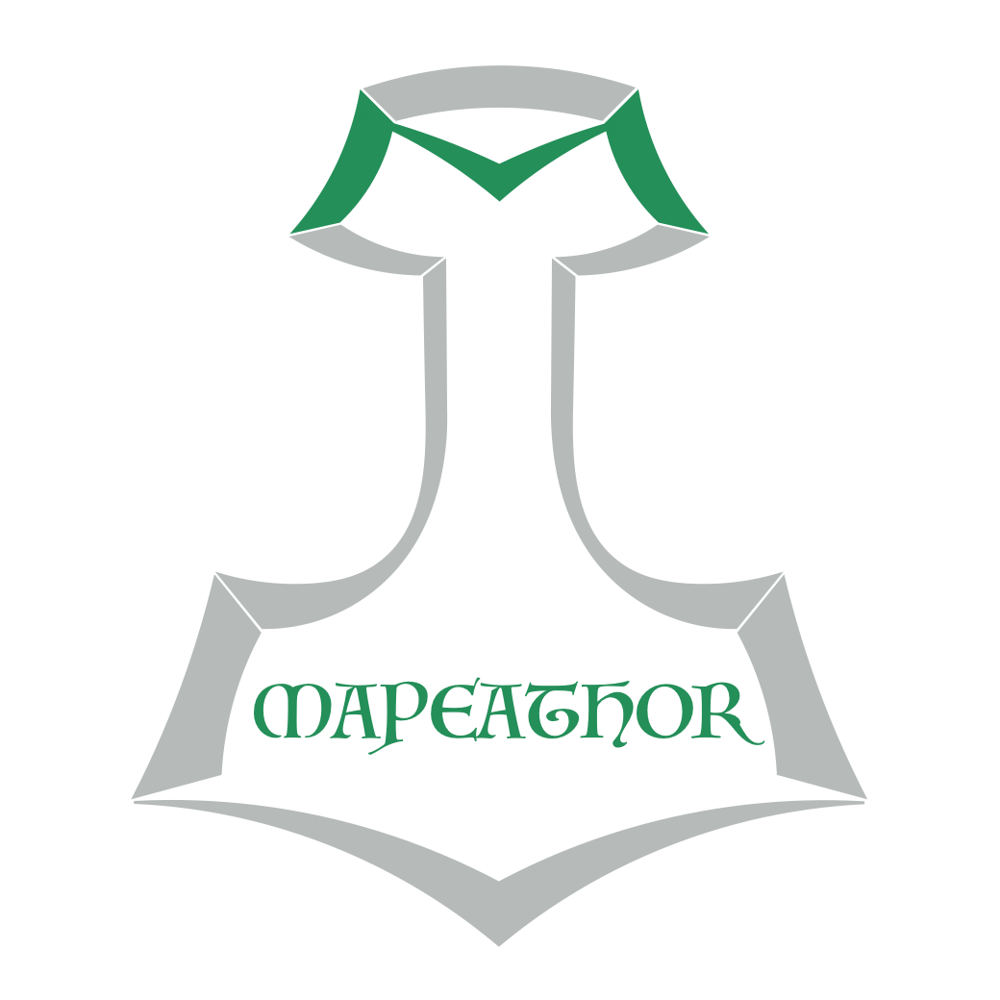
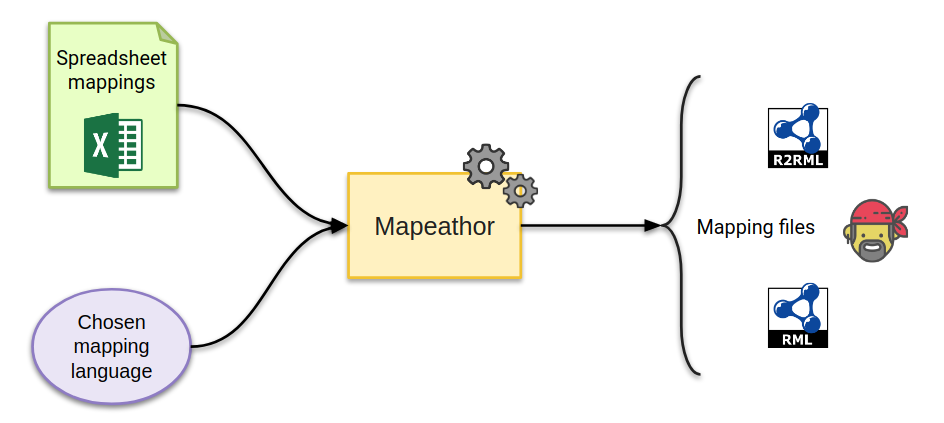
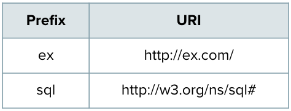
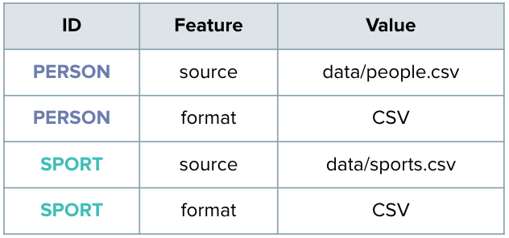
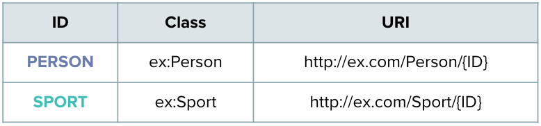
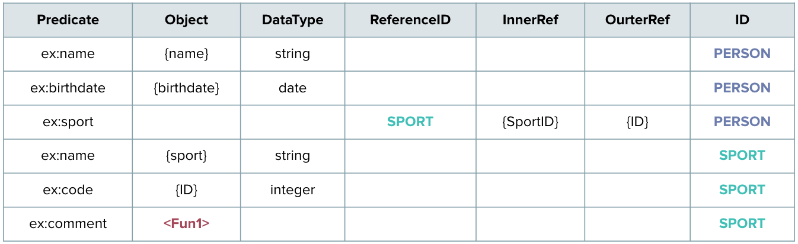
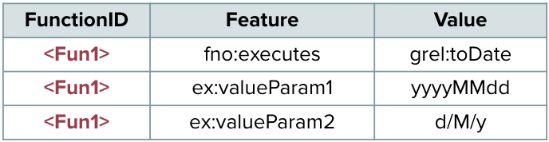

 [](https://www.python.org/)  
 [](https://shields.io/)
 [](https://github.com/oeg-upm/Mapeathor/blob/master/LICENSE)
 [](https://www.python.org/downloads/release/python-360/)

<p align="center"> 
  
</p>


# Mapeathor
#### Mapeathor translates your mapping rules specified in spreadsheets to a mapping language.  

Mapeathor is a simple spreadsheet parser able to generate mapping rules in three mapping languages: R2RML, RML (with extension to functions from FnO) and YARRRML. It takes the mapping rules expressed in a spreadsheet and transforms them into the desired language. The spreadsheet template is designed to facilitate the mapping rules' writting, with the aim of being language independent, and thus, lowering the barrier of generating mappings for non-expert users. 

<p align="center"> 
  
</p>

## Example:    
### First Step: Fill the xlsx template with your own information.  
The template has five mandatory sheets, *Prefixes, Source, Subject PredicateObjectMap* and *Functions*. The last one can be left blank in case there are no functions. The spreadsheet can be in XLSX format or a Google Spreadsheet.
#### Prefixes:   
<p align="center"> 
  
</p>

#### Source:  
<p align="center"> 
  
</p>
 
#### Subject:    
<p align="center"> 
  
</p>

#### PredicateObjectMaps:    
<p align="center"> 
  
</p>

#### Functions:
<p align="center"> 
  
</p>

### Second Step: Choose the output language that you prefer. 
Here you can see the [Available Languages](./templates).

### Third Step: Run Mapeathor:
#### Local XLSX file
With python:
```BASH
# Clone the repository
$ git clone https://github.com/oeg-upm/Mapeathor

# Install the needed packages
$ cd Mapeathor/code/
$ pip3 install -r requirements.txt

# How to execute it
$ python3 main.py -i path/to/YOURFILE -l [RML | R2RML | YARRRML]

# Help Menu
$ python3 main.py -h 

# Example
$ python3 main.py -i ../data/default.xlsx -l rml
```
With docker:
```BASH
# Clone the repository
$ git clone https://github.com/oeg-upm/Mapeathor

# Install the docker image with docker-compose
$ docker-compose up -d

# Copy the XLSX files to data repository
$ cp yourfiles ./data/

# Execute it
$ docker exec -it mapeathor ./run.sh /Mapeathor/data/YOURFILE [RML | R2RML | YARRRML]

# Results will appear in result folder
```

#### Google Spreadsheet
Before using this option, you have need to have a Google account and configure the Google Drive API. First, you need to habilitate the Drive API as described [here](https://developers.google.com/drive/api/v3/enable-drive-api). Once enabled, you need to create a [OAuth 2.0 client credential](https://developers.google.com/identity/protocols/oauth2/) in the left sidebar, in Credentials; and download the `credentials.json` file.

Then, you need to create a `config.ini` file as it is shown below, where credentials_path is the path to the credentials.json file, and spreadsheet_id the unique id of the google spreadsheet. The last one can be extracted from the URI of the spreadsheet, the long id between '/' '/'. 
```
[drive_config]
credentials_path = path/to/credentials/file.json
spreadsheet_id = unique id of google spreadsheet
```

Then, you can run Mapeathor:
```BASH
$ python3 main.py -i path/to/YOURCONFIGFILE -l [RML | R2RML | YARRRML]

# Example
$ python3 main.py -i driveAPI/config.ini -l rml
```

And with Docker:
```BASH
$ docker exec -it mapeathor ./run.sh /Mapeathor/code/driveAPI/YOURCONFIGFILE [RML | R2RML | YARRRML]

```

### Publications
Iglesias-Molina, A., Chaves-Fraga, D., Priyatna, F., & Corcho, O. (2019). Towards the Definition of a Language-Independent Mapping Template for Knowledge Graph Creation. *In Proceedings of the Third International Workshop on Capturing Scientific Knowledge co-located with the 10th International Conference on Knowledge Capture (K-CAP 2019)* (pp. 33-36). [Online version](https://sciknow.github.io/sciknow2019/papers/SciKnow_2019_paper_4.pdf)

### Authors and contact
- [Ana Iglesias-Molina](https://github.com/anaigmo) (ana.iglesiasm@upm.es)
- [Luis Pozo](https://github.com/w0xter) (luis.pozo@upm.es)

