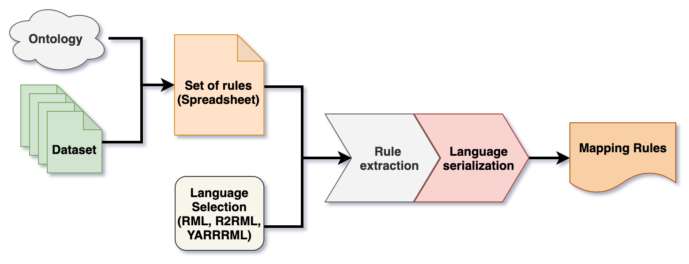
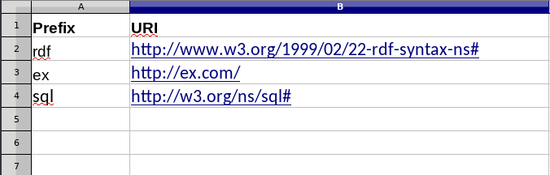
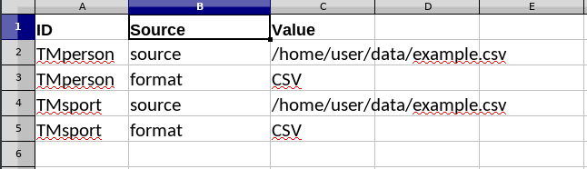
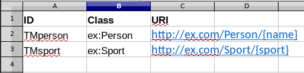
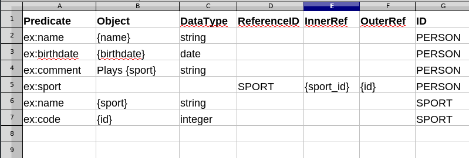

 [](https://www.python.org/)  
 [](https://shields.io/)
# Mapeathor: One mapping to rule them all.
#### Mapeathor transalate your mappings from an abstrac language based in spreadsheets to any mapping language.  
###### Right now is under development, the only supported languages are **RML** **YARRRML** and **R2RML** and the Functions are not implemeted.  
## How it works:  
**Mapeathor it's a simple spreadSheet parser that identifies the basic structures of the mappings and create a new file in a specific mapping language.**  
    
## Example:    
- #### First Step: Fill the xlsx template with your own information.  
The template has four mandatory sheets (*Prefixes, LogicalSource, SubjectMap and PredicateObjectMap*). 
#### Prefixes:  
  
  
 #### LogicalSource:  
  
  
 #### SubjectMap:  
  
  
 #### PredicateObjectMaps:  
  
  

- #### Second Step: Choose the output langauge that you prefer. [Avaible Languages](./templates)  
- #### Third Step: Execute these commands:
```BASH
$ git clone https://github.com/w0xter/Mapeathor
$ cd Mapeathor/code/
$ pip3 install -r dependencies.txt
$ python3 main.py -i /PATH/OF/YOUR/XLSX/FILE -l MappingLanguageNameChoosed
$ python3 main.py -h #Shows The Help Menu
#Example:
$ python3 main.py -i ../data/default.xlsx -l yarrrml
```
